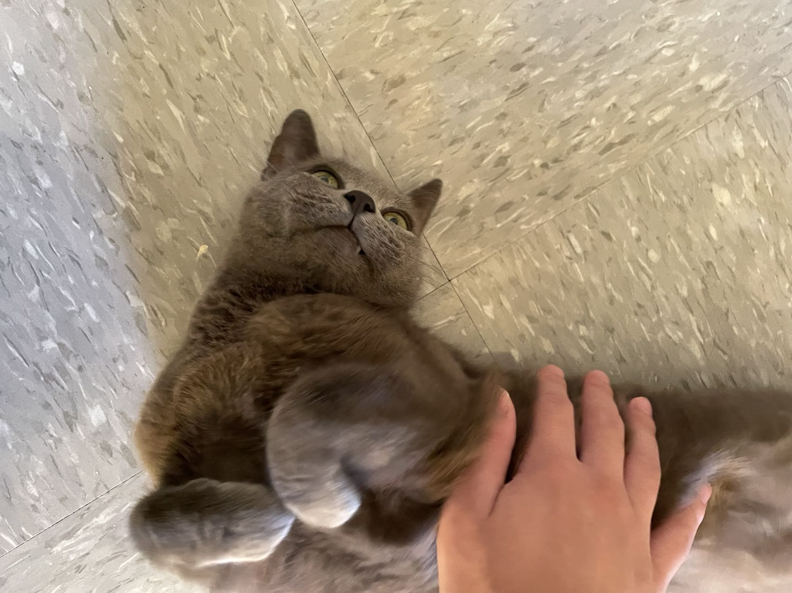

Hi there, I am a first year master student in biostatistics department at Columbia University. The website is a project for P8105 Data Science I. I am specializing in Public Health Data Science and am dedicated in coding. In the future, I wanna become a software engineer.

In my spare time, I love to play the guitar and play with Graciy. Graciy is my roomate's cat, she is rather gentle and elegant, I really love her.

